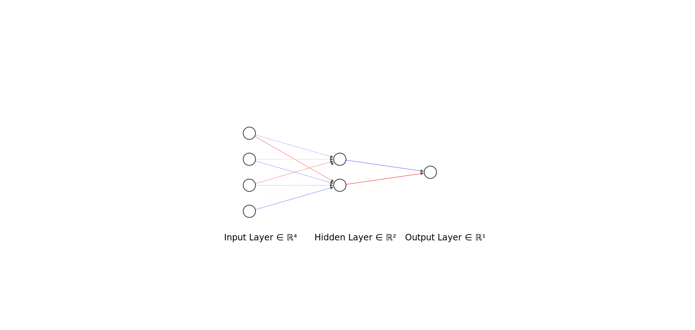

## Using genetic algorithms to train neural network in OpenAI gym environment. 
***

### Explanation

Here is an MLP architecture for Cartpole-v0. The input vector has length 4 (observation from the environment). 
There is one hidden layer (size 2) and the output layer with sigmoid function as action. 
To train the neural network we can use backpropagation algorithm, however here I use a genetic algorithm. 
The goal of the GA is to find the optimal values of weights and biases for a given network. 

1. The population of the networks is created
2. Fitness function for each network is calculated for selection operation
3. The weights and biases are transformed into a vector for crossover and mutation operations
4. If child fitness is greater than parent fitness score the new population is updated
5. Go to 2.
  



***
## Cartpole-v0

**Environment** (continuous):
 - Cart Position
 - Cart Velocity
 - Pole Angle
 - Pole Velocity at Tip

**Actions** (discrete):
 - Push cart to the left
 - Push cart to the right 

**Reward**: 1 for every step taken, including the termination step

**Episode Termination**
 - Pole Angle is more than ±12°
 - Cart Position is more than ±2.4 (center of the cart reaches the edge of the display)
 - Episode length is greater than 200

**Neural network architecture**: simple MLP
 - Input size: 4
 - One hidden layer, size: 2
 - Output layer with Softmax activation function, size: 1
 
**Genetic algorithm parameters**:
 - population size: 100
 - generation: 20
 - mutation rate: 0.4
 - crossover rate: 0.9
 
 | Random cartpole   | GA cartpole           | 
| ------------- |:-------------:|
|      |  | $1600 |


***

Run on [**Spell**](https://web.spell.run/robjan/)
```shell script
spell run "python bipedalwalker.py" --pip-req requirements.txt
```