## Usage of genetic algorithms to train a neural network in the multiple OpenAI gym environments. 

***
| Random Carracing | GA Carracing |
| ------------- |:-------------:|
| 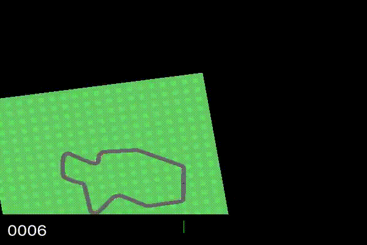 |  |

 | Random BipedalWalker-v2 | GA BipedalWalker-v2 | Small BipedalWalker-v2<span style="color:blue">*</span> | 
| ------------- |:-------------:| :-------------: |
| 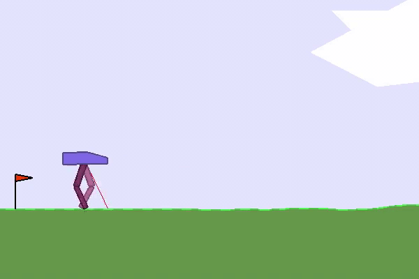 |  |  |

<span style="color:blue">*</span> -- see more [here](#pruning-trained-neural-network)

| Random Cartpole-v0 | GA Cartpole-v0 | 
| ------------- |:-------------:|
| 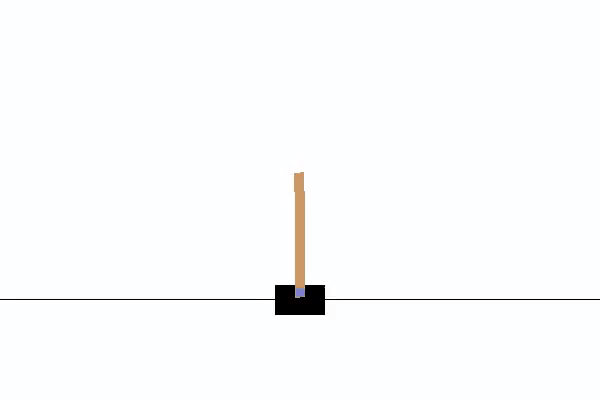 | 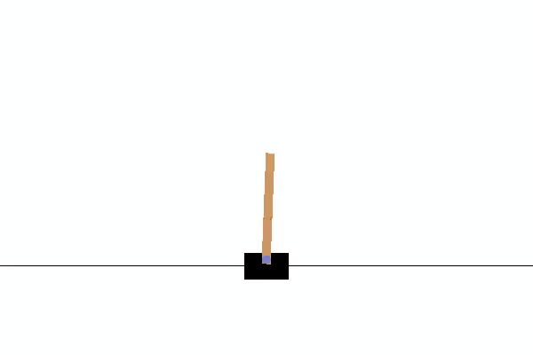 |

| GA SlimeVolley-v0 | 
| ----------------- |
| 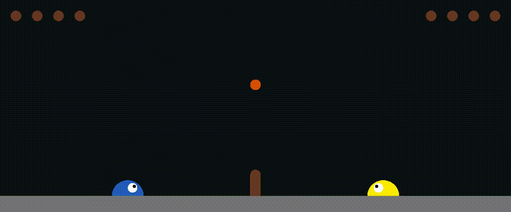 |
| The [Slime Volleyball environment](https://github.com/hardmaru/slimevolleygym/) turned out to be quite hard for proposed method. The interesting fact to observe is that trained agent (on the right) tries to imitate movement of its opponent.| 


Table of contents
==================

* [Overview](#overview)
* [Usage](#usage)
* [Details](#details)
* [Extra experiments](#extra-experiments)
  * [Model compression and knowledge distillation](#model-compression-and-knowledge-distillation)
  * [Multitask learning](#multitask-learning)
* [Environments](#environments)

Overview
========

The project aims to train neural networks using genetic algorithms. Instead of minimalizing the cost function using common optimizers such as: SGD or Adam the simple GA was used.
The algorithm was tring to alter the weights and biased of the neural network to produce the best score of the fitness function. 
The profound description of genetic algorithms as well as the used environments are shown below.

Usage
=====

### Preliminary

Create virtual environment (`python3 -m venv name-of-venv && source name-of-venv/bin/activate`) and install all necessary packages (`pip install -r requirements.txt`). 

### Test pretrained model

The pretrained models are located in `models/{name_of_environment}` directory. For example to check how the model performs in BipedalWalker environment, specify name of the
pretrained model in `tests/bipedalwalker/testing_model_bipedalwalker.py` script (also model adjust model architecture) and run that script.

### Train neural models

Due to my limited computing resources, for training neural models I used [Spell](https://web.spell.run/robjan/) platform (I really recommend it for smaller project)

```shell script
spell run "python scripts/spell/bipedalwalker_mlp_spell.py" --pip-req requirements.txt
```
For _Carracing_ environment (need to open virtual display server)
```shell script
spell run --apt python-dev --apt cmake --apt zlib1g-dev --apt libjpeg-dev \
	--apt xvfb --apt ffmpeg --apt xorg-dev --apt python-opengl --apt libboost-all-dev \
	--apt libsdl2-dev --apt swig \ 
	"Xvfb :1 -screen 0 1024x768x24 -ac +extension GLX +render -noreset &> xvfb.log ; export DISPLAY=:1 ; python scripts/spell/carracing_conv_spell.py" \ 
	--pip-req requirements.txt
```

Details
=======

The question arises, since the main objective of neural network is to minimalize the cost function, why can't we use the genetic algorithms instead of SGD or Adam optimizer?
The approach, used in this project, assumes application of simple GA in order to train the neural networks in the multiple OpenAI Gym environments.

### From neural network to genotype

| 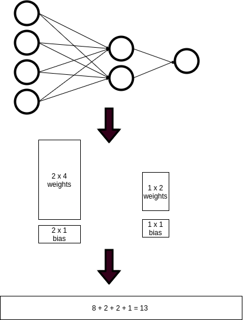 | 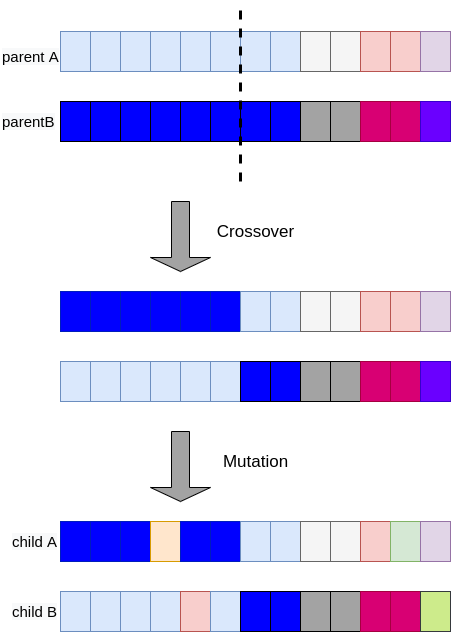 |  |
| -- | -- | -- |

The figure on the left hand-side depicts the steps in order to turn the weights and biases of the neural network into the genotype. Firstly, the matrices are flattened and the biases vectors are
concatenated to them. After one episode of the genetic algorithm, the genotype (vector) is converted into the input neural network architecture (the figure on the right hand-side).

### Genetic Algorithm

The vast number of genetic algorithms are constructed using 3 major operations: _selection_, _crossover_ and _mutation_. In those experiments I checked many different types of the mentioned algorithms.

1. **Setup** -- As in many various generic algorithms at the beginning the population of individuals (neural networks) are created. The weights and biases of them are initialized randomly.
2. **Selection** -- For each individual the fitness function are calculated. I tested both the ranking and the roulette wheel selection and the former method worked significantly better. As the result, the two individuals are selected with the highest fitness score.
3. **Crossover** -- The 'parents' (two neural networks) are decomposed into the flat vectors and then the simple or the [BLX-alpha](http://www.tomaszgwiazda.com/blendX.htm) crossover is
   performed. 
4. **Mutation** -- Each made child has a chance to mutate i.e., alter the weights or biases. I found out that bigger mutation (uniform distribution with large range) is vital to achieve greater results.
5. **Repeat** -- If the sum of fitness score of the created children is greater than theirs parents, the children go to the next generation. The process starts from the beginning
   (step 2.) until the number of the generations reached the limit or the fitness score was satisfied.

#### Fitness function

The calculation of the fitness function varies, it depends on the environment. However, the basic example to compute is as follows:
```python
env = gym.make("your environment")

def compute_fitness_function(env, model, n_episodes: int):
  obs = env.reset()
  fitness = 0
  for n in n_episodes:
    action = model(obs)
    obs, reward, done, info = env.step(action)
    fitness += reward
    if done:
      break
  return fitness
```

| 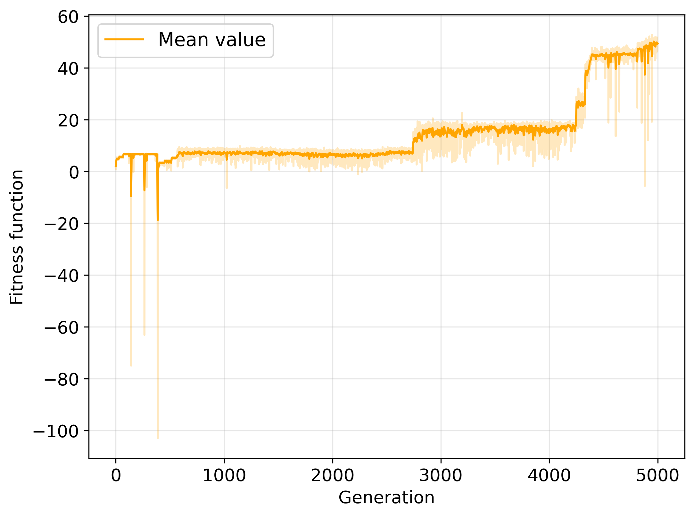 |
|:---:| 
| Mean value of the fitness function for BipedalWalker-v2 problem |

The fitness function in this example is non monotonic and the variance for the generation above 1000 is sizeable. 
These situations were common during training.

Extra experiments
=================

## Model compression and knowledge distillation

### Pruning trained neural network

_Can we reduce the sizes of the neural network while keeping good performance in the particular environment?_ The first step was to gather the training data for the smaller (student) model i.e. I took the best model (from BipedalWalker environment) and ran it multiple times whilst saving both the features (observations from environment) and the labels (models' actions). The initial neural model architecture was shrinkage significantly, from `24-20-12-12-4` to `4-4-4`, interestingly, preserving the ability to complete the task. 

## Multitask learning

| 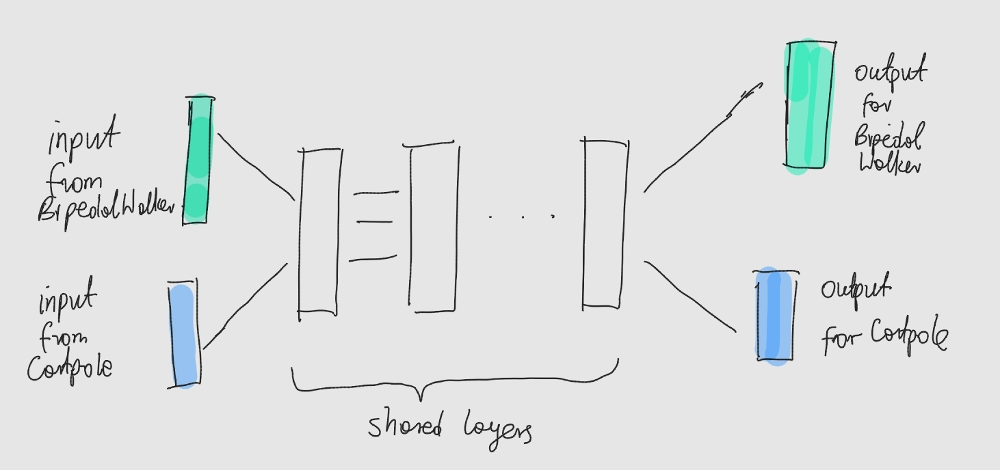 | 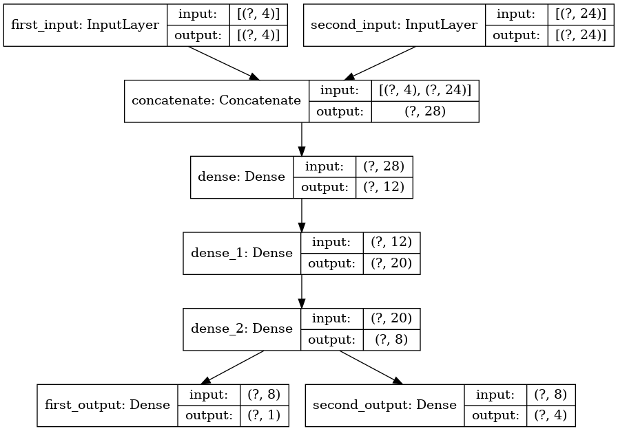 | 
| :------------------------------------------------: | :------------------------------: |
| Example scheme for training the agent in two environments  | Example model architecture for multitask learning | 

I used _Hard parameters sharing_ approach to train both the CartPole and BipedalWalker agents. The figures above depict how the neural model architecture looks like.

I also checked how the trained model will behave, if I fed it with different input values, that is:

1. Both agents receive correct observations from environments
2. CartPole agent receives random noise from uniform distribution, while BipedalWalker agent receives correct observations
3. CartPole agent receives correct observations, while BipedalWalker agent receives random noise from uniform distribution
4. Both agents receive random noise from uniform distribution.

The results are shown below. To conclude, the both model inputs are important, but not equally. It is clearly visible that for 2. option, despite noised observations in CartPole, the BipedalWalker agent performs reasonable well.

|  | 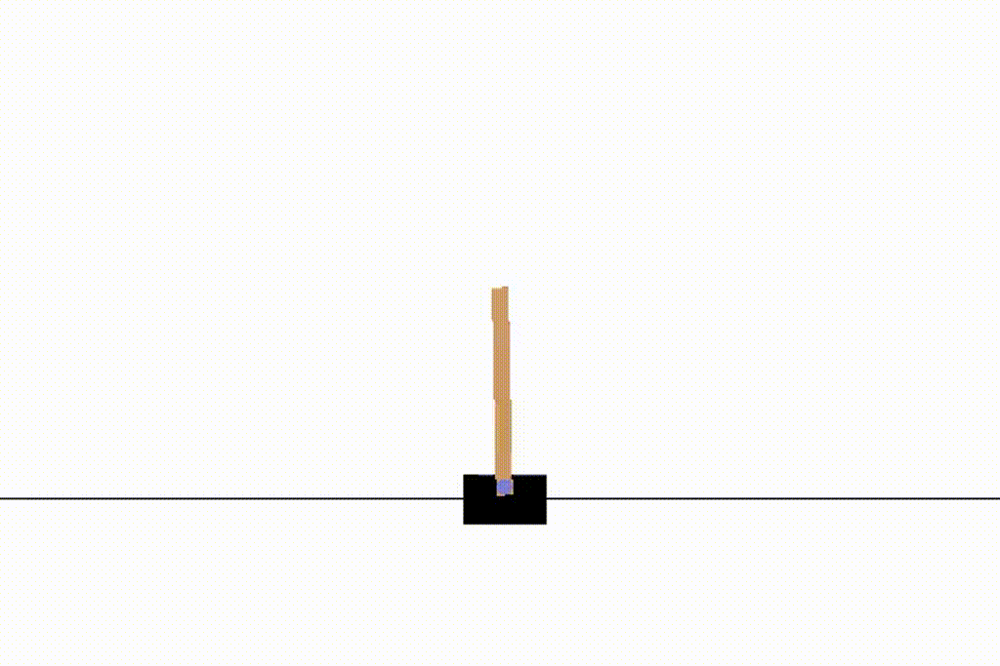 | 
| :-------------------------------------------------------------------------: | :--------------------------------------------------------------------: |
| 1. BipedalWalker                   | 1. CartPole                                                                     |
| 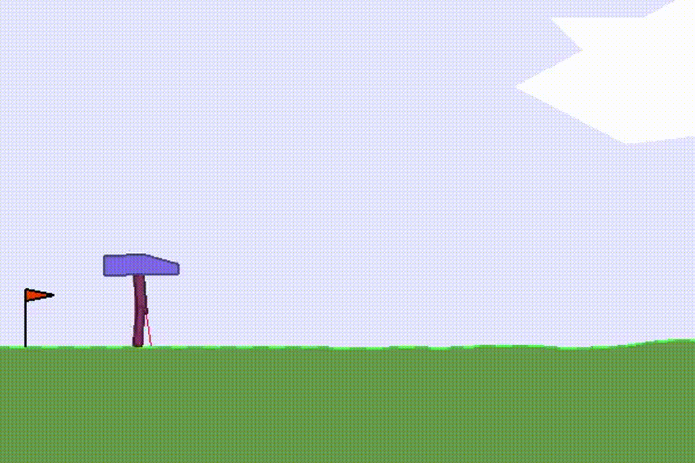 | 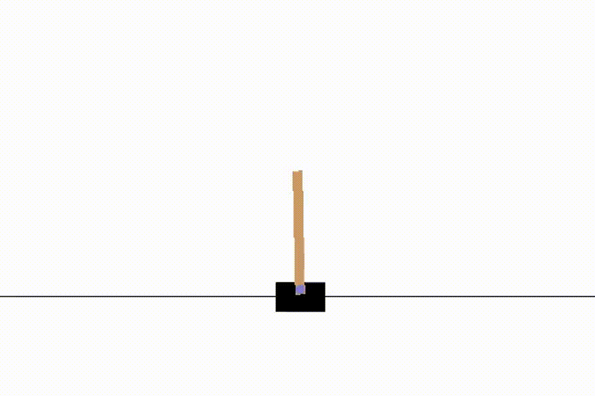 | 
| 2. BipedalWalker |2. CartPole |
|  |  | 
| 3. BipedalWalker | 3.CartPole |
|  |  | 
| 4. BipedalWalker | 4. CartPole | 


Environments
============

<table>
  <tr>
	  <th><i><h4><a href="https://gym.openai.com/envs/CarRacing-v0/">CarRacing-v0</a></h4></i></th>
	  <th><i>Architecture</i></th>
  </tr>
  <tr>
	  <td><b>Observation space</b>:<br>- RGB 96x96 pixels frame (with all the control bar on the bottom of the screen)</td>
    <td rowspan="4">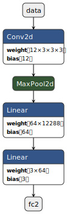</td>
  </tr>
  <tr>
	  <td><b>Actions</b>(continues):<br>- sterring angle (s = [-1, 1])<br>- throttle (t = [0, 1])<br>- brake (b = [0, 1])</td>
  </tr>
  <tr>
	  <td><b>Reward</b><br>- (-0.1) every frame and +1000/N for every track tile visited, 
		    <br>   where N is the total number of tiles in track<br></td>
  </tr>
  <tr>
	  <td><b>Genetic algorithm parameters</b><br>- population size: 50 <br>- generation: 2000 <br>- mutation rate: 0.4 <br>- crossover rate: 0.8</td>
  </tr>
</table>

<table>
  <tr>
	  <th><i><h4><a href="https://github.com/openai/gym/wiki/BipedalWalker-v2">BipedalWalker-v2</a></h4></i></th>
	  <th><i>Architecture of neural network</i></th>
  </tr>
  <tr>
    <td><b>Environment</b> (continuous)<br>- 24 observations (hull_angle, vel_x, vel_y and many more)</td>
    <td rowspan="5">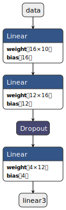</td>
  </tr>
  <tr>
    <td><b>Actions</b> (continues): <br>- Hip_1 and Hip_2 (Torque / Velocity) <br>- Knee_1 and Knee_2 (Torque / Velocity)</td>
  </tr>
  <tr>
	  <td><b>A reward</b> is given for moving forward, total of 300+ points up to the far end. If the robot falls, it gets -100</td>
  </tr>
  <tr>
    <td><b>Episode Termination</b> <br> The episode ends when the robot body touches ground or the robot reaches the far right side of the environment</td>
  </tr>
  <tr>
    <td><b>Genetic algorithm parameters</b><br>- population size: 50 <br>- generation: 2000 <br>- mutation rate: 0.3 <br>- crossover rate: 0.9<br></td>
  </tr>
</table>

<table>
  <tr>
	  <th><i><h4><a href="https://github.com/openai/gym/wiki/CartPole-v0">Cartpole-v0</a></h4></i></th>
	  <th><i>Architecture of the NN</i></th>
  </tr>
  <tr>
	  <td><b>Environment</b> (continuous)<br> - 4 observations (Cart Position and Velocity, Pole Angle and Velocity at Tip)</td>
    <td rowspan="5"> 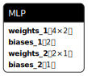</td>
  </tr>
  <tr>
	  <td><b>Actions</b> (discrete):<br> - Push a cart to the left or right</td>
  </tr>
  <tr>
	  <td><b>Reward</b> <br>- 1 for every step taken, including the termination step<br></td>
  </tr>
  <tr>
	  <td><b>Episode Termination</b><br> - Pole Angle is more than ±12°<br> - Cart Position is more than ±2.4 (center of the cart reaches the edge of the display)<br> - Episode length is greater than 200</td>
  </tr>
  <tr>
	  <td><b>Genetic algorithm parameters</b><br> - population size: 100<br> - generation: 20<br> - mutation rate: 0.4<br> - crossover rate: 0.9<br></td>
  </tr>
</table>

<table>
  <tr>
	  <th><i><h4><a href="https://github.com/hardmaru/slimevolleygym">SlimeVolley-v0</a></h4></i></th>
	  <th><i>Architecture of the neural network</i></th>
  </tr>
  <tr>
	  <td><b>Environment</b> (continuous)<br> - 12-dim vector with position and velocity of each agents and the ball </td>
    <td rowspan="5"> 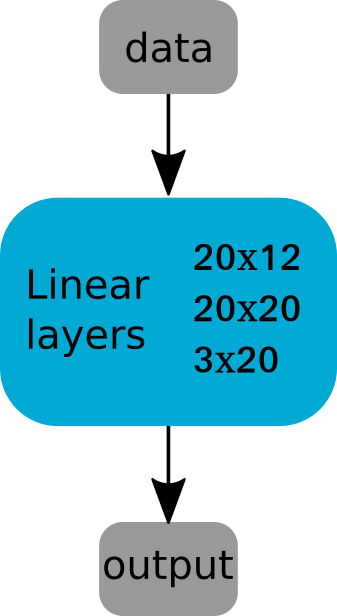 </td>
  </tr>
  <tr>
	  <td><b>Actions</b> (discrete):<br> - 3-dim vector (go left, right or jump)</td>
  </tr>
  <tr>
	  <td><b>Reward</b> <br> For that task I designed custom fitness function: <br>
       <a href="https://www.codecogs.com/eqnedit.php?latex=R&space;=&space;\sum_{i=0}^{elapsed\_episodes}&space;\left(&space;reward_i&space;&plus;&space;\gamma&space;\cdot&space;agent\_lives&space;&plus;&space;\beta&space;\cdot&space;(total\_lives&space;-&space;enemy\_lives)&space;\right)&space;&plus;&space;\alpha&space;\cdot&space;elapsed\_episodes" target="_blank"></a>
       </td>
  </tr>
  <tr>
  <td><b>Episode Termination</b><br> The episode ends when either the agent losses all five lives, or after 3000 timesteps have passed </td>
  </tr>
  <tr>
	  <td><b>Genetic algorithm parameters</b> <br>
    - Population: 30 <br>
    - Number of generations: 2000 (the best model at iteration 1824) <br>
    - Mutation rate: 0.1 <br>
    - Crossover rate: 0.8 <br>
    </td>
  </tr>
</table>

***

