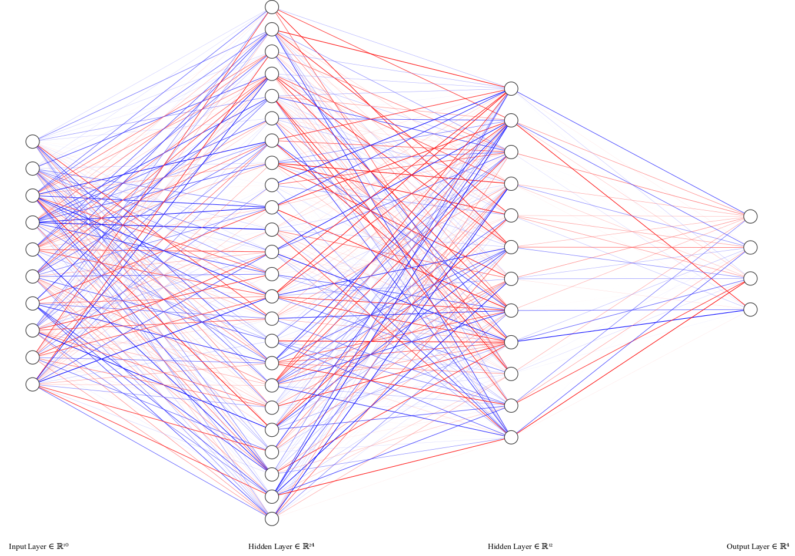

## Using genetic algorithms to train neural network in OpenAI gym environment. 
***

 | Random BipedalWalker-v2 | GA BipedalWalker-v2 | 
| ------------- |:-------------:|
|  |  |

 | Random Cartpole-v0 | GA Cartpole-v0 | 
| ------------- |:-------------:|
|  |  | $1600 |


### Explanation

Here is an MLP architecture for Cartpole-v0. The input vector has length 4 (observation from the environment). 
There is one hidden layer (size 2) and the output layer with sigmoid function as action. 
To train the neural network we can use backpropagation algorithm, however here I use a genetic algorithm. 
The goal of the GA is to find the optimal values of weights and biases for a given network. 

1. The population of the networks is created
2. Fitness function for each network is calculated for selection operation
3. The weights and biases are transformed into a vector for crossover and mutation operations
4. If child fitness is greater than parent fitness score the new population is updated
5. Go to 2.

|  | gigit 
|:---:| 
| Architecture of neural network used in BipedalWalker-v2 problem |

## [BipedalWalker-v2](https://github.com/openai/gym/wiki/BipedalWalker-v2)

**Environment** (continuous)
 - 24 observations (hull_angle, vel_x, vel_y and many more)

**Actions** (continues):
 - Hip_1 and Hip_2 (Torque / Velocity)
 - Knee_1 and Knee_2 (Torque / Velocity)
 
**Reward** is given for moving forward, total 300+ points up to the far end. 
If the robot falls, it gets -100

**Episode Termination**
The episode ends when the robot body touches ground or the robot reaches far right side of the environment

**Neural network architecture**: simple MLP
 - Input size: 10
 - One hidden layer, size: 24
 - Second hidden layer, size: 12
 - Output layer with `tanh` activation function, size: 4
 
**Genetic algorithm parameters**:
 - population size: 50
 - generation: 2000
 - mutation rate: 0.3
 - crossover rate: 0.9


## [Cartpole-v0](https://github.com/openai/gym/wiki/CartPole-v0)

**Environment** (continuous)
 - 4 observations (Cart Position and Velocity, Pole Angle and Velocity at Tip)

**Actions** (discrete):
 - Push cart to the left or right

**Reward**: 1 for every step taken, including the termination step

**Episode Termination**
 - Pole Angle is more than ±12°
 - Cart Position is more than ±2.4 (center of the cart reaches the edge of the display)
 - Episode length is greater than 200

**Neural network architecture**: simple MLP
 - Input size: 4
 - One hidden layer, size: 2
 - Output layer with Softmax activation function, size: 1
 
**Genetic algorithm parameters**:
 - population size: 100
 - generation: 20
 - mutation rate: 0.4
 - crossover rate: 0.9
 
***

Run on [**Spell**](https://web.spell.run/robjan/)
```shell script
spell run "python scripts/bipedalwalker.py" --pip-req requirements.txt
```
For car racing (need to open virual display server)
```shell script
spell run --apt python-dev --apt cmake --apt zlib1g-dev --apt libjpeg-dev \
	--apt xvfb --apt ffmpeg --apt xorg-dev --apt python-opengl --apt libboost-all-dev \
	--apt libsdl2-dev --apt swig \ 
	"Xvfb :1 -screen 0 1024x768x24 -ac +extension GLX +render -noreset &> xvfb.log ; export DISPLAY=:1 ; python scripts/spell/carracing_conv_spell.py" \ 
	--pip-req requirements.txt
```
